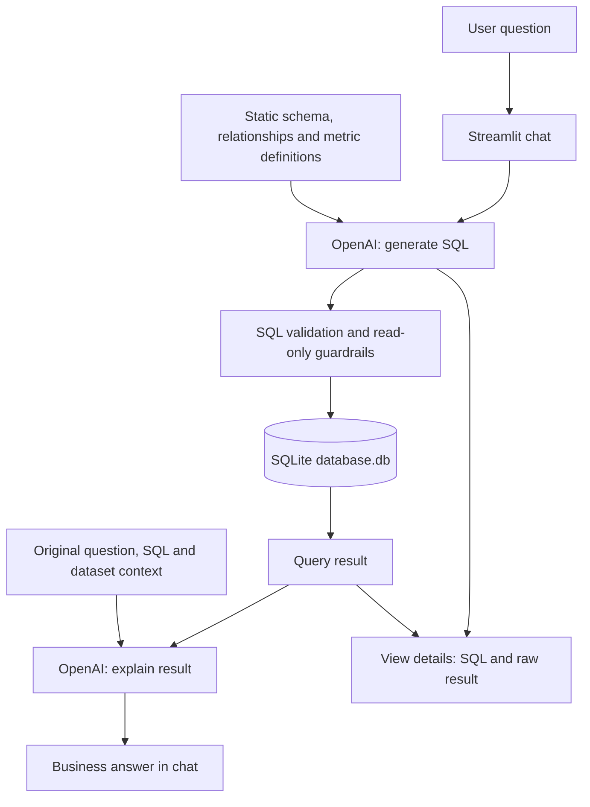
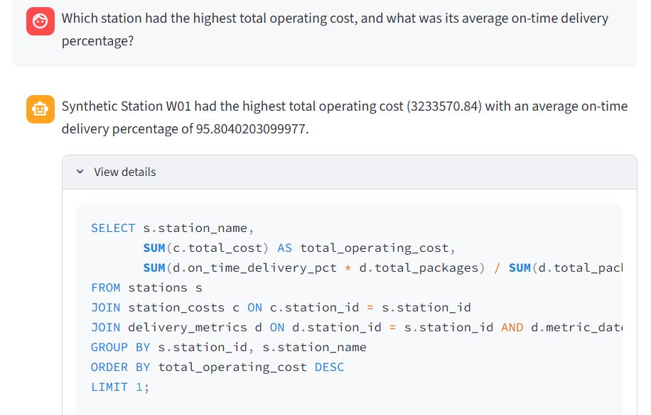
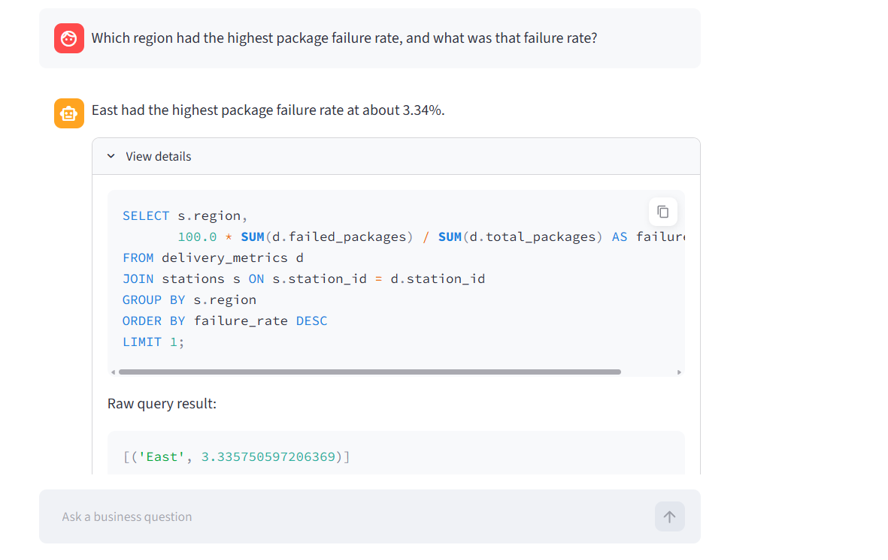
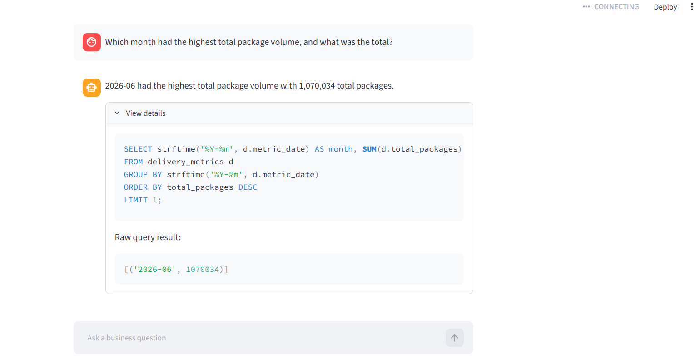

# AI SQL Analytics Assistant

A Python and Streamlit application that turns natural-language business questions into SQLite queries and concise business answers. The project demonstrates schema-aware SQL generation, multi-table analytics, and read-only database execution using a fully synthetic logistics dataset.

## Problem

Business users often need answers from structured data but may not know SQL. This assistant lets them ask questions about delivery performance and operating costs in natural language, then inspect both the answer and the underlying query results.

## How It Works

User question → Streamlit chat interface → OpenAI LLM generates SQL using database schema and relationships → SQL validation/read-only guardrails → SQLite executes the query → Query result is sent to the LLM → Business-friendly answer is displayed.

Each successful request makes two OpenAI API calls: one to generate SQL and one to explain the results. The answer appears in chat, with generated SQL and raw results under **View details**. Session state preserves visible chat history during reruns; previous messages are not sent to the model, so questions are handled independently.

## Architecture



`app.py` contains the chat interface and query flow. `set_db.py` builds the dataset; `check_data.py` prints counts, relationship checks, and a sample JOIN summary.

## Synthetic Dataset

**All data is synthetic and contains no proprietary or confidential company data.** Station names and operational values are fictional and generated locally with a fixed random seed.

The dataset covers **8 stations**, **4 regions**, and **181 days**, from **January 1 to June 30, 2026**. Invented patterns include lower weekend volume, gradual growth, and a temporary regional disruption.

| Table | Rows | Contents |
| --- | ---: | --- |
| `stations` | 8 | `station_id` (primary key), `station_name`, `region` |
| `delivery_metrics` | 1,448 | `metric_id` (primary key), `metric_date`, `station_id`, `total_packages`, `failed_packages`, `on_time_delivery_pct`, `induction_rate` |
| `station_costs` | 1,448 | `cost_id` (primary key), `cost_date`, `station_id`, `total_cost` |

Both daily tables reference `stations.station_id` and have a unique station/date pair. To combine deliveries and costs, join on **both** `delivery_metrics.station_id = station_costs.station_id` and `delivery_metrics.metric_date = station_costs.cost_date`. Joining on station alone duplicates daily records and inflates totals.

Dates use `YYYY-MM-DD`. Package counts include failed attempts; on-time delivery percentage measures on-time packages against all attempts. Induction rate is packages per operating hour, and costs represent fictional USD. The model's context specifies package-weighted on-time percentages, failure rates from summed counts, and cost per package from summed cost divided by summed volume. These are prompt instructions, not enforced business-rule validation.

## Example Questions

- Which region had the highest package failure rate?
- Show monthly package volume and total operating cost by region.
- Which station had the highest total operating cost, and what was its average on-time delivery percentage?
- Compare cost per package across regions in June 2026.
- What was the average daily induction rate for each station?

## Example SQL

The assistant generated this query for the monthly package volume and operating cost question during a demo run:

```sql
SELECT
    strftime('%Y-%m', d.metric_date) AS month,
    s.region,
    SUM(d.total_packages) AS package_volume,
    SUM(c.total_cost) AS total_operating_cost
FROM delivery_metrics d
JOIN stations s ON d.station_id = s.station_id
JOIN station_costs c
    ON c.station_id = d.station_id
    AND c.cost_date = d.metric_date
GROUP BY month, s.region
ORDER BY month, s.region;
```

This produces 24 rows: six months for each of four regions. Generated SQL can vary between requests. SQLite `REAL` cost sums may show floating-point artifacts in raw results.

## Safety / Guardrails

The current implementation in `app.py`:

- Requires SQL to begin with `SELECT` after trimming whitespace, case-insensitively. Queries beginning with `WITH` or comments are not accepted.
- Uses `EXPLAIN QUERY PLAN` to check preparation and permissions before executing the query.
- Uses SQLite's `execute()` method, which rejects multiple statements.
- Installs an authorizer that allows SELECT, reads, and SQL functions except `load_extension`; other operation types are denied.
- Opens the database with `mode=ro` to prevent writes through the application connection.
- Displays validation or SQLite errors and skips answer generation when the query fails.

These checks restrict database operations; they do not guarantee correct joins, calculations, or answers. There is no custom query timeout or result-size limit. The database setup script intentionally uses a writable connection to rebuild the demo tables.

## Tech Stack

- **Python** - application logic and synthetic data generation
- **OpenAI API / Python SDK** - `gpt-5` through the Responses API for SQL generation and result explanation
- **SQLite / Python `sqlite3`** - relational data, validation, and query execution
- **Streamlit** - chat interface, session state, and expandable query details
- **python-dotenv** - local environment configuration

## Running Locally

Prerequisites: Git, Python with pip (tested with Python 3.13), and an OpenAI API key with access to the configured model.

1. Clone the repository and enter its directory:

   ```bash
   git clone https://github.com/Amirthabala92/AI-SQL-Analytics-Assistant.git
   cd AI-SQL-Analytics-Assistant
   ```

2. Install dependencies, preferably in a virtual environment:

   ```bash
   python -m pip install -r requirements.txt
   ```

3. Copy `.env.example` to `.env`. In PowerShell:

   ```powershell
   Copy-Item .env.example .env
   ```

   On macOS/Linux, use `cp .env.example .env`. Edit `.env` locally and replace the placeholder:

   ```dotenv
   OPENAI_API_KEY=your_api_key_here
   ```

   Never commit your real key. `.gitignore` excludes `.env` and local database files. Running the app sends questions, schema context, generated SQL, and query results to OpenAI.

4. Create and populate the synthetic database:

   ```bash
   python set_db.py
   ```

   Each run recreates the three demo tables with the same data. Unrelated tables are left untouched. Optionally run `python check_data.py` to inspect the dataset.

5. Launch the application:

   ```bash
   python -m streamlit run app.py
   ```

   Open the local URL printed in the terminal and enter an example question.

## Future Improvements

Not implemented yet:

- Dynamic schema/table retrieval for larger databases
- Stronger SQL validation, query limits, and semantic checks
- Production database support, such as Amazon Redshift
- Cloud deployment
- Visualization and chart generation

## Screenshots

**Station operating cost and on-time delivery:** a business answer with the generated multi-table JOIN.



**Regional failure rate:** the answer, generated SQL, and raw query result.



**Monthly package volume:** a monthly aggregation with its supporting query result.


